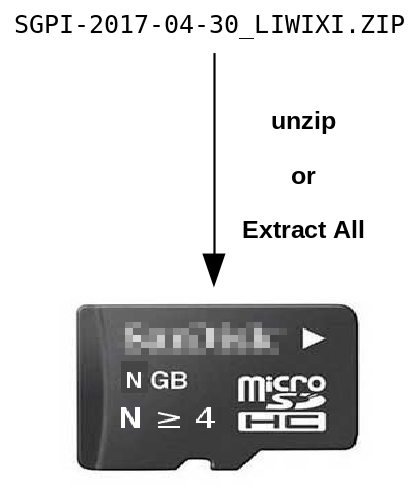

# liwixi - linux where I can see it

Easily install linux onto a μSD card without imaging:


### Known working computer / OS: ###

  2017-04-28:  Raspberry Pi 2/3 with Raspbian 8
  
## For Users ##

- insert a brand new SD card into your laptop

**or**

- format a used SD card as VFAT using your laptop's OS or with one of the tools from

    https://www.sdcard.org/downloads/formatter_4/index.html

- download the liwixi archive from your trusted source e.g. COOLSTUFF_LIWIXI.ZIP

- unzip COOLSTUFF_LIWIXI.ZIP to the SD card

- delete COOLSTUFF_LIWIXI.ZIP - it's *not* needed on the SD card

- safely remove the SD card

- boot the Raspberry Pi with the SD card and...

### Marvel at the Splendour! ###

 - the SD card still has the right size, because instead of a hidden
   linux partition, there is a big fat file called
   COOLSTUFF_LIWIXI_IMAGE_DO_NOT_DELETE right *where you can see it*

 - if you want your SD card back to normal, just delete the files you
   extracted from the LIWIXI archive

 - you didn't have to download, install, and learn to use `Win32DiskImager` or
   `dd` or ...

 - the extra space on your SD card is available, and you can write files to it
   from your laptop, or from the running pi (in /boot).

 - you didn't have to wait for some silly program to write zeroes to the 50% or more
   of your SD card that is still available.

 - the same LIWIXI archive could have been unpacked onto any SD card of sufficient
   size, and no parititon resizing is required.

 - you can have multiple kernels and versions of linux on the same SD card; select
   which one is booted by editing config.txt to change these lines:
   ```
   kernel=kernel7.img
   initramfs=COOLSTUFF_LIWIXI_INITRAMFS_DO_NOT_DELETE
   ```
   to whatever is appropriate for a different version.  The
   "...INITRAMFS..." and "...IMAGE..."  for a particular version of linux
   have to be used together; the first knows the name of the second,
   and causes linux to use it.

 - if COOLSTUFF needs extra storage for a linux-style filesystem, it
   might create more big fat files called
   COOLSTUFF_LIWIXI_STORAGE_N_DO_NOT_DELETE where N is 1, 2, ...,
   However, we encourage the COOLSTUFF developer to store media and
   data files directly on the SD card's VFAT filesystem, so you can
   access them if you pop the SD card into your laptop.

## For Developers ##

Linux can use a loopback device for its root file system; you just
have to make sure an appropriate initramfs script takes care of
setting it up on a filesystem image before the kernel needs it.
This repo provides a tool to create such an image from a working
system.

After booting, the entire SD card will be mounted as a VFAT filesystem
at /boot and at /dev/sdcard.  The linux image file is then recursively
accessible as /boot/BRAND_LIWIXI_IMAGE_DO_NOT_DELETE.  The small
initramfs used to set-up /dev/loop0 is then
/boot/BRAND_LIWIXI_INITRAMFS_DO_NOT_DELETE

The image created includes an additional 25% of free space within the
ext4 filesystem, to support the growth of logfiles, etc.  You can of
course allocate further VFAT-file-backed loopback filesystems on the
SD card if you need more storage for software packages and so on.  But
if your linux is intended for data acquisition, consider writing data
files to the VFAT filesystem directly - do you really need the
features of a linux filesystem enough to justify having the data files
invisible to your non-linux users when they pop the SD card into their
own computer?

None of this is original or clever, but it might lower the barrier for
people just starting in small computer linux, and ease the tedium for
developers creating images for them.

### Requirements ###

- a small computer running a recent linux, e.g. Raspbian on the Pi 2/3,
  whose image you wish to distribute as a LIWIXI archive.  You should
  be logged into a root shell on this machine.

- a USB memory stick or other additional storage should be mounted for use
  as both temporary and destination storage for the LIWIXI archive.

- make sure you have the zip and initramfs-tools packages installed; e.g.:
```
apt-get install zip initramfs-tools
```
- grab liwixi:
```bash
git clone https://github.com/jbrzusto/liwixi/master
```
- run the script:
```bash
cd liwixi
./pliwixi BRAND DEST [TEMP]
```
where:

   - BRAND: a string identifying your linux distribution; whitespace
     is probably toxic

   - DEST: path to a folder on a device with enough room to store
     your compressed image plus boot files

   - TEMP: optional path to a folder on a device with enough room to
     store your *uncompressed* image plus boot files;
     defaults to $DEST, which must then have enough room for both the
     compressed and uncompressed images combined.

DEST and TEMP should be on a USB memory stick or other external storage that
you have already mounted, because the SD card itself is comparatively slow
for large transfers, and might not have sufficient storage anyway.

Do ./pliwixi for more details and options.

After some chugging, and a chance to customize the image from a shell,
you end up with a file called
`
${DEST}/${BRAND}_LIWIXI.ZIP
`

which your users can unzip onto a fresh VFAT SD card and use directly;
see:  For Users (above).

# Deployment === Testing - use at your own risk #
